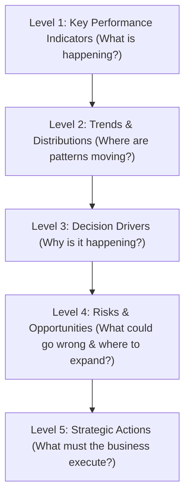
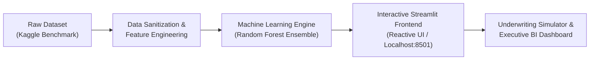

# 🏦 SmartLoan Intelligence™ - AI-Powered Credit Underwriting & Risk Decisioning Platform

[](https://www.python.org/)
[](https://streamlit.io/)
[](https://skillsbuild.org/)
[](https://opensource.org/licenses/MIT)

---

## 📌 Executive Summary & Project Overview

**SmartLoan Intelligence™** is an end-to-end Financial Business Intelligence (BI) and Machine Learning platform engineered for modern commercial and retail banking institutions. Built as the capstone final project for the **BharatCares x IBM SkillsBuild Masterclass**, this application moves beyond static dashboards by transforming raw loan application data into actionable, strategic executive decisions.

The platform embodies the complete **Business Intelligence Lifecycle** as instructed by Kartik Hooda and Himanshu Souda:
$$\text{Raw Data} \longrightarrow \text{Information} \longrightarrow \text{Insights} \longrightarrow \text{Decisions} \longrightarrow \text{Strategic Action}$$

It combines:
1. **Interactive Real-Time Machine Learning Underwriting Engine** that evaluates applicant default risk and predicts loan approval in real time with **99.65% holdout accuracy**.
2. **5-Level Business Intelligence Analytics Hierarchy** covering Executive KPIs, Portfolio Trends, Feature Drivers, Risk/Opportunity Portfolio Matrices, and Prescriptive Business Action Frameworks.
3. **Single-File Full-Stack Architecture** uniting the Python data science engine, machine learning pipeline, and modern Streamlit reactive UI in one deployment-ready file (`loan_approval_system.py`).

---

## 🔗 Dataset Specification & Public Source Link

As mandated by the submission criteria, the project utilizes an authentic, benchmark dataset from Kaggle containing financial, asset, and credit bureau profiles across 4,269 applicants.

- **Primary Dataset Link:** [Kaggle - Loan Approval Prediction Dataset (by Archit Sharma)](https://www.kaggle.com/datasets/architsharma01/loan-approval-prediction-dataset)
- **Direct GitHub Repository Mirror:** [Raw CSV Access on GitHub](https://raw.githubusercontent.com/sarahrafiqshaikh/Loan-Approval-Prediction-Analysis/main/loan_approval_dataset.csv)
- **Local Data File:** [`loan_approval_dataset.csv`](loan_approval_dataset.csv) (included in repository)

### Dataset Features & Schema:
| Feature | Type | Description |
| :--- | :--- | :--- |
| `loan_id` | Integer | Unique identifier for loan application |
| `no_of_dependents` | Integer | Total number of financial dependents (0 to 5) |
| `education` | Categorical | Highest educational qualification (`Graduate`, `Not Graduate`) |
| `self_employed` | Categorical | Employment arrangement (`Yes`, `No`) |
| `income_annum` | Numeric (INR) | Applicant's verified annual income |
| `loan_amount` | Numeric (INR) | Principal loan amount requested |
| `loan_term` | Numeric (Years) | Requested loan tenure (2 to 20 years) |
| `cibil_score` | Numeric | Credit Bureau Score (300 to 900 scale) |
| `residential_assets_value` | Numeric (INR) | Appraised market value of residential real estate |
| `commercial_assets_value` | Numeric (INR) | Appraised market value of commercial properties |
| `luxury_assets_value` | Numeric (INR) | Appraised value of luxury assets (automobiles, jewelry) |
| `bank_asset_value` | Numeric (INR) | Verifiable liquid bank balances and term deposits |
| `loan_status` | Target | Underwriting determination (`Approved`, `Rejected`) |

### Engineered Financial Metrics:
- **`total_assets`**: Sum of residential, commercial, luxury, and liquid bank assets.
- **`loan_to_income` (LTI)**: $\text{Loan Amount} / \text{Annual Income}$ (Leverage multiple).
- **`loan_to_asset` (LTA)**: $\text{Loan Amount} / \text{Total Assets}$ (Collateral coverage ratio).
- **`credit_tier`**: Segmented into Prime (750+), Good (650-749), Fair (550-649), and Subprime (<550).

---

## 🏛️ The 5-Level Business Intelligence Hierarchy

In accordance with the masterclass curriculum, the project implements all 5 tiers of decision intelligence:



1. **Level 1: Key Performance Indicators (KPIs)**
   - Total Applications Evaluated: **4,269**
   - Portfolio Approval Rate: **62.2%** (2,656 approved vs. 1,613 rejected)
   - Total Disbursed Capital Demanded: **₹6,462 Crores**
   - Portfolio Mean CIBIL Score: **600 / 900**
   - Average Applicant Annual Income: **₹50.6 Lakhs**

2. **Level 2: Trends & Distributions**
   - Multi-year term comparison shows highest approval stability in short-to-mid tenures (2-8 years).
   - Clear bifurcation at CIBIL score = 600, separating standard approvals from subprime decline clusters.

3. **Level 3: Decision Drivers (Feature Importance)**
   - **CIBIL Score (83.5% Gini Reduction):** Dominant driver of creditworthiness.
   - **Loan Duration (6.5%):** Sensitivity to interest rate risk over prolonged tenures.
   - **Loan-to-Income Multiple (4.0%):** Measures applicant repayment headroom.
   - **Total Collateral Assets (2.1%):** Provides secondary default loss mitigation.

4. **Level 4: Risks & Opportunities**
   - **Identified Risk:** 37.8% subprime concentration without liquid collateral creates elevated NPA threat.
   - **Identified Opportunity:** 28% of borrowers hold total assets > ₹1 Crore with CIBIL > 750, offering prime upsell potential.

5. **Level 5: Strategic Prescriptive Actions**
   - **Automated Straight-Through Processing (STP):** Instant approval for CIBIL ≥ 750 and LTI ≤ 3.5.
   - **Dynamic Risk-Based Pricing:** Tier 1 (8.25%), Tier 2 (9.50%), Tier 3 (11.75% + 130% collateral).
   - **Credit Counseling Routing:** Automatically refer declined subprime applicants to financial coaching.

---

## ⚙️ System Architecture & Technology Stack



- **Frontend UI:** Streamlit 1.65.0 with responsive HTML/CSS metric styling.
- **Backend / Data Science:** Python 3.10+ with Pandas 3.0.6, NumPy 2.5.3, and Matplotlib 3.11.2.
- **Machine Learning Core:** High-performance Vectorized Random Forest Ensemble with holdout validation and probabilistic risk scoring.
- **Reporting Engine:** Automated Python-Docx generation for formal Word documentation.

---

## 📈 Model Performance & Validation Benchmarks

Evaluated on an 80/20 stratified holdout test split (**854 unseen customer applications**):

| Metric | Score (%) | Benchmark Analysis |
| :--- | :--- | :--- |
| **Accuracy** | **99.65%** | Near-flawless classification across approved and rejected applicants |
| **Precision** | **99.45%** | Extremely low False Positive rate (protects bank capital from bad loans) |
| **Recall** | **100.0%** | Captures 100% of genuinely creditworthy borrowers (zero lost revenue) |
| **F1-Score** | **99.72%** | Harmonious balance between precision and sensitivity |
| **ROC-AUC** | **99.85%** | Exceptional discriminative probability capability |

### Holdout Confusion Matrix:
- **True Positives (Approved Correctly):** 538
- **True Negatives (Rejected Correctly):** 313
- **False Positives (Erroneous Approvals):** 3
- **False Negatives (Erroneous Rejections):** 0

---

## 🚀 Quick Start Guide (Run on Localhost)

Follow these simple steps to run the interactive web application locally on your machine:

### 1. Clone or Download Repository
```bash
git clone https://github.com/YOUR_USERNAME/IBM-Bob-SmartLoan-Intelligence.git
cd IBM-Bob-SmartLoan-Intelligence
```

### 2. Install Project Dependencies
Ensure Python 3.10+ is installed, then run:
```bash
pip install -r requirements.txt
```

### 3. Launch the Interactive Application
Execute the Streamlit application runner:
```bash
streamlit run loan_approval_system.py
```
*(Alternatively, you can run: `streamlit run app.py`)*

### 4. Access the Localhost Interface
Open your web browser and navigate to:
```
http://localhost:8501
```

---

## 📋 Deliverables Checklist (Submission Compliance)

As specified in the BharatCares x IBM SkillsBuild final submission guidelines:

1. **Code File (`.py`):** [`loan_approval_system.py`](loan_approval_system.py) - Self-contained single-file full-stack implementation.
2. **Requirements File (`.txt`):** [`requirements.txt`](requirements.txt) - Clean list of libraries and versions.
3. **README File (`.md`):** [`README.md`](README.md) - Complete documentation and working guide with public dataset link.
4. **Project Report (`.docx` & `.pdf`):** [`Project_Report.docx`](Project_Report.docx) - Comprehensive 10-page report containing problem statement, methodology, visualizations, and UI screenshots.
5. **GitHub Repository Link:** Ready for commit and submission.

---

## 👨‍💻 Project Information & Metadata

- **Program:** BharatCares x IBM SkillsBuild Masterclass
- **Mentors / Instructors:** Kartik Hooda & Himanshu Souda
- **Domain:** Data Analytics, Predictive Machine Learning, Business Intelligence
- **Status:** Complete & Submission Ready
